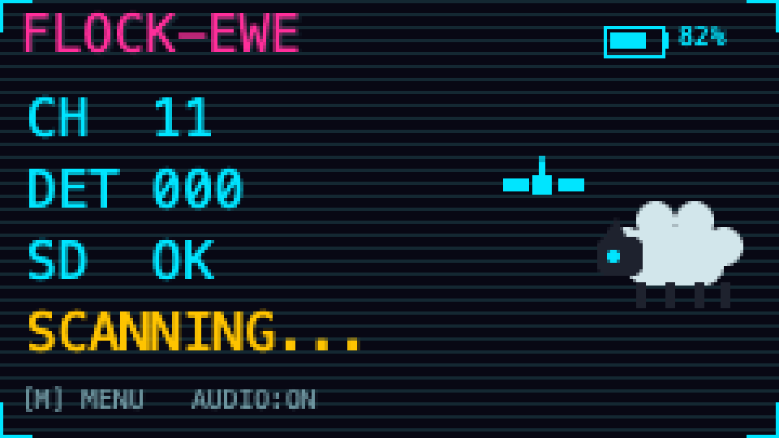

# Flock-Ewe

A passive, receive-only WiFi scanner for the M5Stack CardputerADV that
detects nearby Flock Safety ALPR (automated license plate reader) camera
units and alerts you on-device. It never transmits, associates, or
interferes with any network — it only listens.

Loosely inspired by [Flock-You](https://github.com/colonelpanichacks/flock-you)
(ESP32-S3 / XIAO), which pioneered the detection approach used here. That
repo carries no license, so this project reimplements the detection
algorithm independently rather than copying its code — see
[Detection approach](#detection-approach) below.

**Disclaimer:** this is a research/privacy-auditing tool. It only receives
public over-the-air broadcast frames; you are responsible for complying
with your local laws regarding RF reception and monitoring.



## Hardware

- M5Stack CardputerADV (ESP32-S3, ST7789V2 display, TCA8418 keyboard,
  ES8311 speaker codec, microSD slot) — [buy](https://amzn.to/4xcuYYL)
- [M5Stack Cap LoRa-1262](https://docs.m5stack.com/en/cap/Cap_LoRa-1262)
  expansion module — [buy](https://amzn.to/45yumkh) — used here only for
  its onboard GNSS chip (ATGM336H),
  read over UART (NMEA) at 115200 baud on board pins RX=**GPIO15**,
  TX=**GPIO13**. The module's SX1262 LoRa radio isn't used by this
  project yet.

  Note the pins are the reverse of what M5Stack's own docs table seems to
  suggest (it reads "GPS_RX=G13, GPS_TX=G15") — that table is apparently
  labeled from the GNSS module's own perspective, not the board's, and an
  earlier version of this firmware took it at face value and got zero
  NMEA data as a result, on any baud rate. The pins above were confirmed
  by cross-referencing [psifertex/meshtastic-firmware](https://github.com/psifertex/meshtastic-firmware)'s
  working CardputerADV variant definition. If the GPS status screen
  (**G** from idle) still shows `LINK NONE` outdoors with this config,
  suspect wiring/antenna rather than pins or baud.

## Detection approach

Two independent signals, either of which triggers an alert:

1. **OUI matching** — the transmitting MAC's vendor prefix is checked
   against a table of 30 confirmed Flock Safety hardware prefixes in
   [flock_detect.cpp](flock_detect.cpp). MAC OUI-to-vendor assignments are
   public IEEE registry data (https://standards-oui.ieee.org/) — add more
   entries there as you confirm additional hardware.
2. **Probe IE fingerprint** — Flock Safety units emit a distinctive
   wildcard probe request (empty SSID) with a specific sequence of
   Information Element tags. `matchesFlockProbeSignature()` parses the
   IEs from a captured probe request and compares the tag signature
   against the known fingerprint.

Matches are deduplicated per-MAC with a 5-second cooldown so a single
camera doesn't spam repeat alerts.

## On-device UI

The screen has four states: an idle/scanning screen, a full-screen alert,
a settings menu, and a GPS status screen.

- Press **M** on the idle screen to open **Settings**, where **Enter**
  toggles audio alerts on/off; press **M** again to go back. The idle
  screen always shows a `[M] MENU` / `AUDIO:ON` hint at the bottom.
- Press **G** on the idle screen to open **GPS status**: link/comms
  status (`LINK OK`/`LINK NONE`), satellite count, and current lat/lng/
  altitude if there's a fix. Press **G** again to go back.
- On detection, the screen flashes to the alert view and holds for
  **10 seconds**, beeping once a second (if audio alerts are on) with a
  live countdown to the idle screen. A new detection while the alert is
  already showing resets the 10-second hold and refreshes the displayed
  MAC/RSSI/match info rather than queuing behind it.
- Neither the menu nor the GPS screen is reachable while an alert is
  showing — a real detection always takes priority.
- A small cyan satellite icon appears just above and left of the CyberEwe
  mascot (and on the GPS status screen) when the GNSS has a fix, and
  disappears entirely otherwise — a dimmer color for "no fix" was tried
  first, but grey vs. cyan was too hard to tell apart on this small
  screen.
- A battery icon + percentage sits in the top-right corner on every
  screen — cyan above 50%, amber 20-50%, magenta at 20% or below, or
  hint-grey with `--` if the level can't be read. It's a rolling average
  of the last ~3 seconds of readings (see [battery.h](battery.h)/[battery.cpp](battery.cpp)),
  not an instantaneous one — this device is almost always mid-scan
  (WiFi promiscuous mode, channel-hopping), unlike, say, Launcher's idle
  menu, and that current draw can sag the battery rail enough to read
  meaningfully lower at the exact instant it's sampled. Averaging smooths
  out that kind of transient dip. (Confirmed against both Launcher's and
  M5Unified's source that this board's battery formula — GPIO10, 2.0x
  divider, linear 3300-4150mV map — is identical either way; the earlier
  mismatch against Launcher wasn't a formula bug, just an unsmoothed
  single sample caught mid-sag.)

Every screen is composed into an off-screen `M5Canvas` sprite and pushed
to the panel in one shot, rather than drawn primitive-by-primitive
straight to the live display — that's what eliminates the flicker you'd
otherwise see on every redraw (most noticeably the idle screen's 500ms
refresh).

## Firmware setup (Arduino IDE)

1. In **Boards Manager**, install `esp32` by Espressif Systems.
2. Select **Tools > Board > ESP32S3 Dev Module** (there's no dedicated
   Cardputer board entry; the M5Cardputer library handles the rest).
3. Under **Tools**, set:
   - USB CDC On Boot: **Enabled**
   - Partition Scheme: default (8MB) or larger, since PSRAM/flash usage
     is modest but SD/SPIFFS headroom helps
4. In **Library Manager**, install `M5Cardputer` (this pulls in
   `M5Unified`, `M5GFX`, and `IRremote` as dependencies) and `TinyGPSPlus`.
5. Open `FlockEwe.ino` and upload.

## Files

- `FlockEwe.ino` — setup()/loop(), ties everything together
- `wifi_scan.{h,cpp}` — promiscuous-mode capture, channel hopping,
  per-MAC cooldown, hands detections to the main loop via a FreeRTOS queue
- `flock_detect.{h,cpp}` — OUI table + probe IE signature matching
- `ui.{h,cpp}` — on-device display (idle screen, alert screen)
- `gps.{h,cpp}` — reads NMEA position fixes from the Cap LoRa-1262's GNSS chip
- `logger.{h,cpp}` — SD card JSON-lines logging of detections + GPS fix

## Logging

Detections are appended as JSON-lines to a session file on the SD card,
named `flockeweMMDDYYHHmm.txt` from an *estimated local* date/time (e.g.
`flockewe072926143022.txt`). The file is created lazily — on the *first*
detection of the session, not at boot — so a session with no detections
never creates an empty file, and each run gets its own file. If no GPS
fix/time has been acquired yet at that first detection, it falls back to
`flockewe_nofix_<millis>.txt`.

The file is opened, appended to, and closed again on every single write
(rather than held open for the whole session) so a sudden power loss
can't leave it locked or corrupted. `lat`/`lng`/`alt_m`/`sats` are only
present when a GPS fix was available at detection time:

```json
{"t":12345,"mac":"70:C9:4E:AA:BB:CC","rssi":-62,"ch":6,"oui":true,"ie":false,"gps_fix":true,"lat":40.712800,"lng":-74.006000,"alt_m":10.5,"sats":8}
```

**About that "local" time**: this device has no network connection, so
there's no real timezone/DST database to query. `gpsGetLocalDateTime()`
(in [gps.h](gps.h)) approximates it from the GPS's UTC time plus the
fix's longitude (15° per hour of offset), then applies the US DST rule
(2nd Sunday of March – 1st Sunday of November). That means filenames will
be off by about an hour, for roughly two-thirds of the year, in US
regions that don't observe DST — **Arizona, parts of Indiana, Hawaii,
etc.** — since there's no way to detect that from longitude alone.
Outside the US it's just a longitude-based standard-time guess with no
DST adjustment, since DST rules vary by country. If there's no location
fix yet when the first detection happens (only a time fix), it falls
back to plain UTC rather than guessing.

## Using with Launcher

Flock-Ewe is a plain standalone Arduino sketch, which is exactly what
[Launcher](https://github.com/bmorcelli/Launcher) expects — no manifest
or special entry point required. To install it:

1. `Sketch > Export Compiled Binary` in Arduino IDE.
2. Install the resulting `FlockEwe.ino.bin` through Launcher (SD, WebUI,
   or OTA, per Launcher's own docs).

There's currently no in-app "return to Launcher" shortcut — use the
physical reset button (or enable Launcher's "Boot to Launcher" option so
it always stops at the menu instead of auto-booting the last app).

## Testing

[FlockSpoofer](FlockSpoofer/) is a companion sketch for a second, generic
ESP32 board that transmits fabricated probe requests spoofing known
Flock Safety OUIs and the matching IE fingerprint, so you can test the
whole detection pipeline without a real camera nearby. See its own
README for setup and usage.

## Roadmap / ideas

- Keep expanding the OUI table as more Flock Safety hardware is confirmed
- On-screen detection history / log viewer
- Return-to-Launcher shortcut
- Persist the audio-alerts setting across reboots (currently resets to on)
